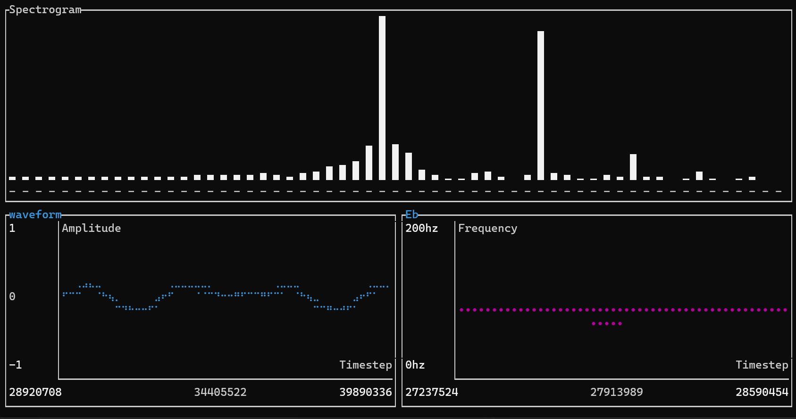

# Pitch2Synth-rs

Rust app to convert an audio stream into a midi stream to trigger external synthesizers.

## Build Instructions

Run ```cargo build --release``` followed by ```target\\release\\pitch2synth-rs.exe``` to build and run an optimized executable

## Architecture

### 4 threads communicate via Bus, an intra-thread ringbuffer

* Audio aquisition thread
  * Managed by CPAL(Cross Platform Audio Library) via callback
  * Communicates via Bus to transmit audio to pitch estimation and UI threads
* Pitch estimation thread
  * Computes Constant-Q transform via Goertzel algorithm
  * Takes argmax of frequency ampltiudes
  * Accounts by harmonic errors
  * Communicates via Bus to transmit frequency data to MIDI and UI threads
* MIDI handler thread
  * Takes pitch data and sends corresponding MIDI note to external synthesizer via USB
* UI Thread
  * Takes audio waveform from audio thread and frequency data from pitch thread and renders GUI


